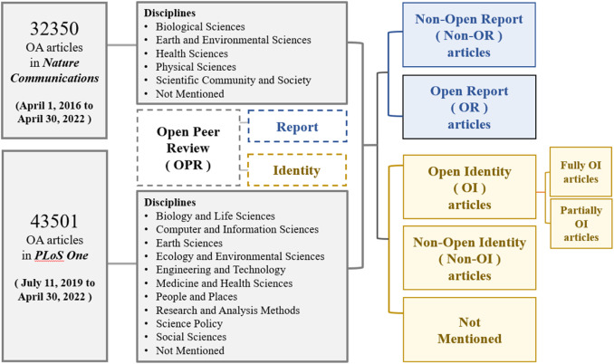

# NC-PO-OpenPeerReview
Research on the impact of open peer review in Nature Communication and Plos One

This repository contains the code and resources for the paper: "Open peer review correlates with altmetrics but not with citations: Evidence from Nature Communications and PLoS One".

The logic for the data scraping process is illustrated in the diagram below:

You can visit our article in https://doi.org/10.1016/j.joi.2024.101540

In the `natureCom_data.py`, we scrapy the data from Journal "Nature Communication".

In the `PlosOne_data.py`, we scrapy the data from Journal "PLOS One".